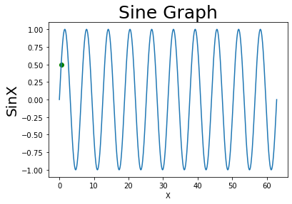

```python
print("Hello")
```

    Hello


```python
import numpy as np                       # 배열생성을 위한 numpy모듈 호출
from matplotlib import pyplot as plt     # 그래프 출력을 위한 pyplot 모듈 호출

start = 0
n =int(input("1번 Sin 2번 Cos 3번 Tan : "))
while n>3:
        n=int(input("1~3사이를 다시 입력해주세요: "))
while n<=3:
    cycle = int(input("주기를 입력하세요:"))
    end =  cycle* np.pi
    if n==1:
        n1=int(input("원하는 Sine값 입력: "))
        plt.scatter(n1*(np.pi/180),np.sin(n1*(np.pi/180)),c='g')
        sx = np.linspace(start,end,1000)     # x 좌표값 생성 (-pi ~ +pi)
        sy = np.sin(sx)
        plt.xlabel("X")
        plt.ylabel("SinX",fontsize=20)
        plt.title("Sine Graph",fontsize=25)
        plt.plot(sx,sy)                            # 그래프에 x,y 입력
        plt.show()                            # y = cos(x) 계산
    elif n==2:
        n1=int(input("원하는 Cos값 입력: "))
        plt.scatter(n1*(np.pi/180),np.cos(n1*(np.pi/180)),c='g')
        cx = np.linspace(start,end,1000)
        cy = np.cos(cx)
        plt.xlabel("X")
        plt.ylabel("CosX",fontsize=20)
        plt.title("Cos Graph",fontsize=25)
        plt.plot(cx,cy)                            # 그래프에 x,y 입력
        plt.show()
    elif n==3:
        n1=int(input("원하는 Sine값 입력: "))
        plt.scatter(n1*(np.pi/180),np.tan(n1*(np.pi/180)),c='g')
        tx = np.linspace(start,end/2,500)
        ty = np.tan(tx)
        plt.xlabel("X")
        plt.ylabel("TanX",fontsize=20)
        plt.title("Tan Graph",fontsize=25)
        plt.plot(tx,ty)
        plt.show()
    n =int(input("1번 Sin 2번 Cos 3번 Tan (종료:다른숫자) : "))
```

    1번 Sin 2번 Cos 3번 Tan : 1
    주기를 입력하세요:20
    원하는 Sine값 입력: 30



    


```python

```